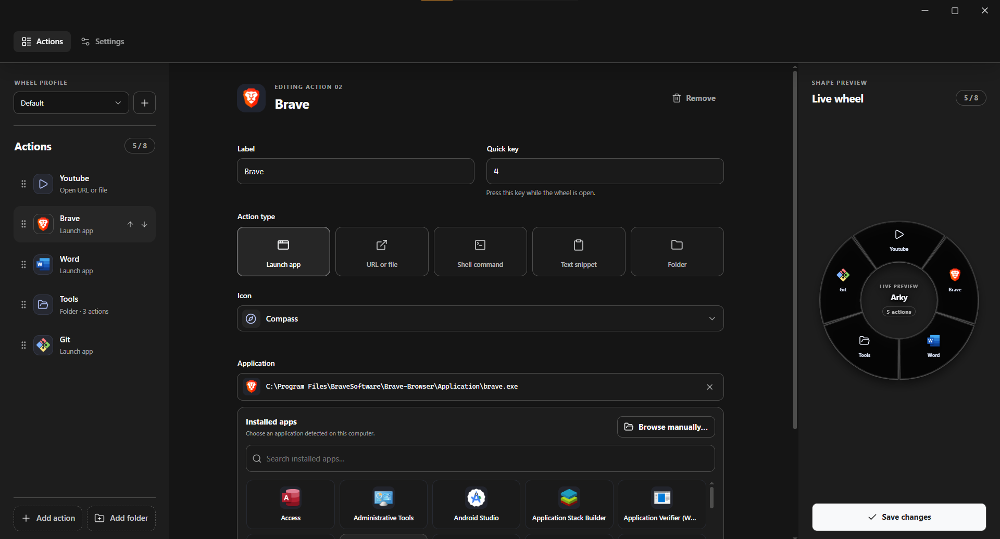

<div align="center">
  
  <h1>Arky</h1>
  <p><strong>Your tools. One gesture.</strong></p>
  <p>A free, open-source action wheel for launching apps, opening links and files, and getting to your next action faster.</p>
  <p>
    <a href="#why-arky">Why Arky</a> ·
    <a href="#get-started">Get started</a> ·
    <a href="#contributing">Contributing</a>
  </p>
  <p>
    <a href="LICENSE"></a>
    
  </p>
</div>



## Why Arky

| Build your wheel | Move at your speed | Make it yours |
| :--- | :--- | :--- |
| Arrange actions and nested folders in the Builder. | Open the wheel at your cursor with a global shortcut. | Create separate profiles for different workflows. |
| Launch apps, open URLs or files, and copy text snippets. | Use quick keys to trigger actions without reaching for the mouse. | Tune the wheel's size, opacity, and behavior. |
| See changes in the live wheel preview. | Revisit copied text and images with clipboard history. | Import or export your configuration. |

Arky runs locally. There is no account, subscription, license key, or payment to get started.

## Get started

Arky is built with [Tauri 2](https://v2.tauri.app/), React, TypeScript, and Rust. Install the [Tauri prerequisites](https://v2.tauri.app/start/prerequisites/) for your operating system, plus Node.js 20 or newer and Rust stable.

```bash
git clone https://github.com/AdibChiguer/Arky.git
cd Arky
npm ci
npm run tauri -- dev
```

The Tauri configuration targets Windows, macOS, and Linux. Platform-specific features, including application discovery and shortcuts, may behave differently across operating systems.

To create an installable bundle:

```bash
npm run tauri -- build
```

## Data and privacy

Your wheel configuration is saved in the operating system's application-data directory. Clipboard history stays in memory and is cleared when Arky exits. Copied text and images can still be sensitive while the app is running. Arky does not need a cloud service to run.

Actions you configure may launch applications or open files and URLs on your computer.

## Contributing

Issues, documentation improvements, and pull requests are welcome. Read [CONTRIBUTING.md](CONTRIBUTING.md) before making a change.

| Task | Command or guide |
| :--- | :--- |
| Frontend development | `npm run dev` |
| Type-check and build | `npm run typecheck` · `npm run build` |
| Rust formatting and tests | `cargo fmt --manifest-path src-tauri/Cargo.toml -- --check` · `cargo test --manifest-path src-tauri/Cargo.toml` |
| Report a security issue | [SECURITY.md](SECURITY.md) |

## License

Arky is available under the [MIT License](LICENSE). Dependencies and bundled assets may have their own licenses.
